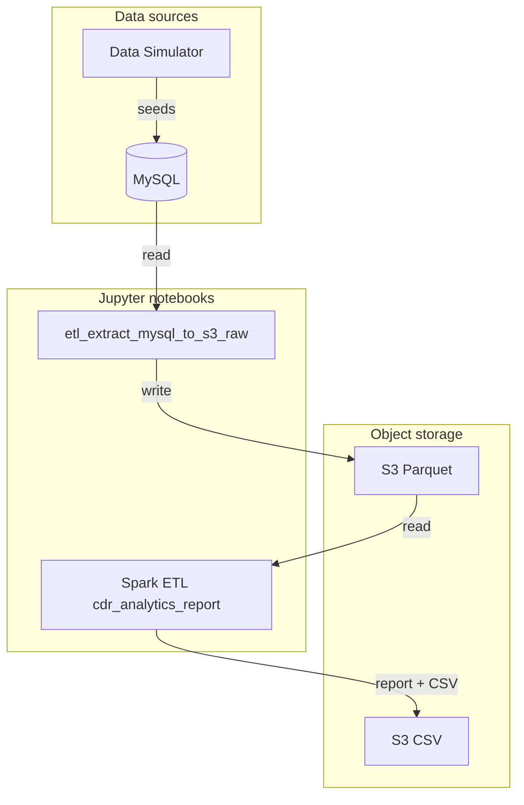

# Spark ETL & Telecom CDR Demo

A comprehensive telecom analytics data pipeline built for OpenShift AI and Spark Operator, implementing a complete data simulation and processing system.

## Project Overview

This repo is a Spark application and OpenShift AI demo that implements a telecom CDR analytics pipeline. A **data simulator** generates realistic customer and call data into **MySQL**; **Spark notebooks** on OpenShift AI (Jupyter) run the ETL (MySQL → S3 Parquet) and analytics (Parquet → report and CSV). Workloads are deployed via GitOps to the `spark.openshift.rhdp` cluster (data-simulator and spark-etl user workloads). Elyra pipelines can run the notebooks in sequence; object storage (S3/MinIO) sits between extract and analytics.

## Flow

## High-level flow

1. **Data simulator** (`datasimulator/`) – Python app that seeds **MySQL** with Telecom CDR data (customers, call records). Deployable as a container; uses the same schema as the Spark pipeline.
2. **MySQL** – Holds the CDR tables. The simulator creates tables and inserts data; notebooks and pipelines read from here.
3. **Spark notebooks** (`spark-etl-datascience-demo/notebooks/`) – Run on OpenShift AI (Jupyter). They read from MySQL or S3, run Spark jobs in client mode, and write Parquet/CSV to S3 (MinIO). Main notebooks:
   - **etl_extract_mysql_to_s3_raw.ipynb** – Extract CDR from MySQL to S3 as Parquet.
   - **cdr_analytics_report.ipynb** – Load latest CDR Parquet from S3, run analytics, show report and upload CSV to S3.

Object storage (S3/MinIO) sits between the extract and analytics steps. Elyra pipelines can run these notebooks in sequence.

## Data schema

Database: **MySQL** `telecom_data`. Same schema is used by the data simulator, ETL notebook (Parquet), and analytics notebook.

### Table: `customers`

| Column              | Type         | Description                    |
|---------------------|--------------|--------------------------------|
| `customer_id`       | VARCHAR(50)  | Primary key                    |
| `name`              | VARCHAR(100) | Customer name                  |
| `phone_number`      | VARCHAR(20)  | Phone number                   |
| `plan_type`         | VARCHAR(50)  | Plan (e.g. prepaid/postpaid)   |
| `registration_date` | TIMESTAMP    | When the customer registered   |
| `status`            | VARCHAR(20)  | e.g. `active`                  |

### Table: `cdr_records`

| Column             | Type          | Description                    |
|--------------------|---------------|--------------------------------|
| `cdr_id`           | BIGINT        | Primary key (auto-increment)   |
| `customer_id`      | VARCHAR(50)   | FK to `customers`              |
| `call_start_time`  | DATETIME      | Call start                     |
| `call_end_time`    | DATETIME      | Call end                       |
| `duration_seconds` | INT           | Call duration                  |
| `call_type`        | VARCHAR(20)   | e.g. voice, SMS                |
| `service_type`     | VARCHAR(50)   | Service type                   |
| `cost`             | DECIMAL(10,2) | Call cost                      |
| `destination_number` | VARCHAR(20) | Called number                  |
| `created_at`       | TIMESTAMP     | Record creation time           |

Indexes: `customer_id`, `call_start_time`, `service_type`.
