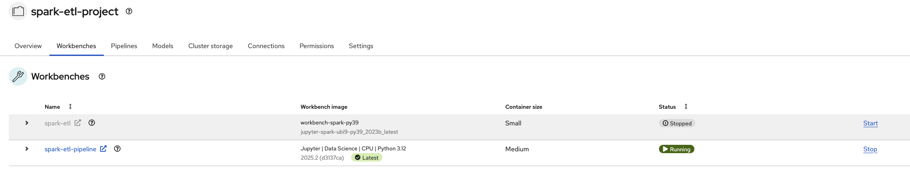
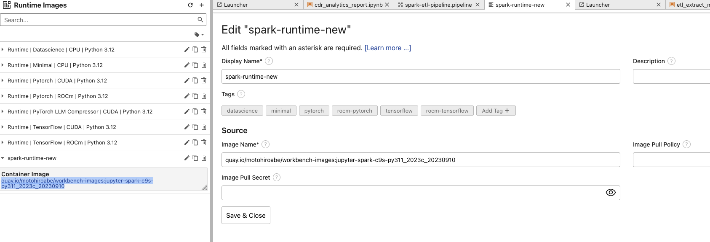
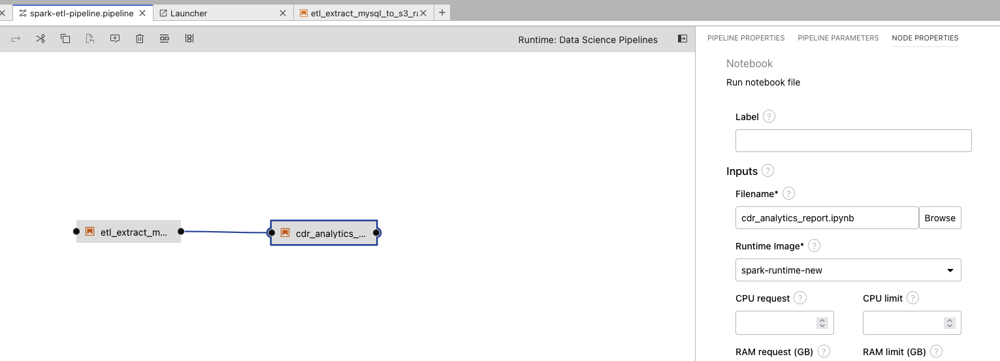
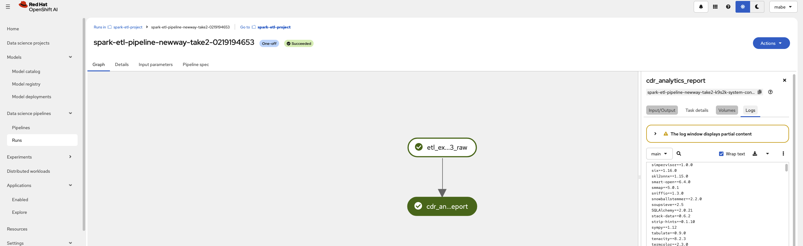
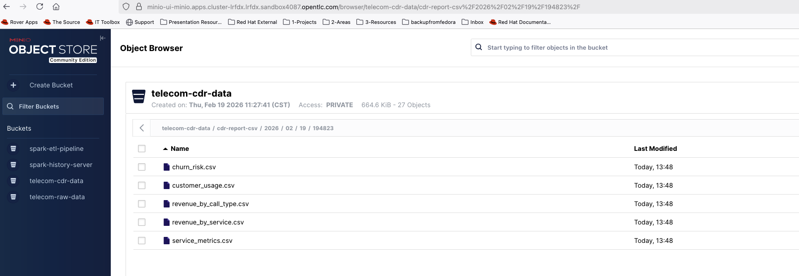
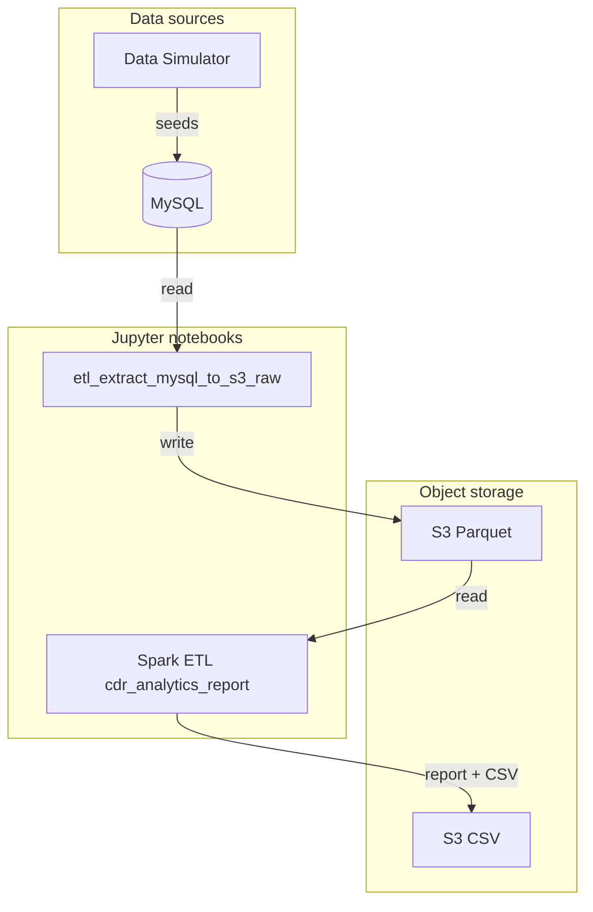

# Running Apache Spark on OpenShift: A Hands-On Guide from Notebooks to Spark Operator

A comprehensive telecom analytics data pipeline built for OpenShift AI and Spark Operator, implementing a complete data simulation and processing system.

## Project Overview

This repo is a Spark application and OpenShift AI demo that implements a telecom CDR analytics pipeline. A **data simulator** generates realistic customer and call data into **MySQL**; **Spark notebooks** on OpenShift AI (Jupyter) run the ETL (MySQL → S3 Parquet) and analytics (Parquet → report and CSV). Workloads are deployed via GitOps to the `spark.openshift.rhdp` cluster (data-simulator and spark-etl user workloads).

Elyra pipelines can run the notebooks in sequence; object storage (S3/MinIO) sits between extract and analytics.

For workloads that require **scaling and resource management**, the pipeline can also be submitted as a **SparkApplication** using the Spark Operator. See the `spark-etl-operator-demo/` directory.

This repo supports two parts of the blog:

- **Part 1** — Spark ETL from JupyterNotebook (client mode): `spark-etl-datascience-demo/`

  [Linke to Demo, Part1](https://www.youtube.com/watch?v=0R0L4NtTEKs)

- **Part 2** — Production-ready Spark with Operator: `spark-etl-operator-demo/`

  [Linke to Demo, Part2](https://www.youtube.com/watch?v=G4mg0e11l3Q)


## Acknowledgments

This project learned from and reused content from the following upstream repositories:

- **[Spark on OpenShift](https://github.com/rh-aiservices-bu/spark-on-openshift)** – Spark on OpenShift patterns and examples. 
- **[Workbench images](https://github.com/rh-aiservices-bu/workbench-images)** – Upstream workbench/Jupyter image build and usage (see [Building an image](https://github.com/rh-aiservices-bu/workbench-images/tree/main#building-an-image)).

## Quick Start

### Prerequisites

- OpenShift cluster with admin access
- MinIO installed and configured
- Spark Operator installed
- Privileged Security Context Constraint (SCC)

This repo includes a **GitOps bootstrap** to cover the cluster setup; see the `bootstrap/` and `cluster/` directories for Argo CD / ApplicationSet manifests targeting the `spark.openshift.rhdp` cluster.

### DataScience project setup

1. **Set up the OpenShift AI project**  
   Create a project named `spark-etl-project`, or apply the manifest:
   ```bash
   oc apply -f spark-etl-datascience-demo/spark-etl-datascience-project.yaml
   ```

2. **Apply network policy**  
   ```bash
   oc apply -f spark-etl-datascience-demo/spark-etl-network-policy.yaml
   ```

3. **Apply RBAC for the workbench**  
   ```bash
   oc apply -f spark-etl-datascience-demo/spark-rbac.yaml
   ```

4. **Prepare a workbench image with PySpark (client mode)**  
   The notebooks run in **client mode**: the Spark driver runs inside the notebook pod, so the workbench image’s Spark/PySpark version must match the executor version.  
   See [Working from inside a workbench](https://github.com/rh-aiservices-bu/spark-on-openshift?tab=readme-ov-file#working-from-inside-a-workbench) in the Spark on OpenShift repo.

5. **Set up the pipeline server**  
   Do this before using the workbench so you can create pipelines in the same project later.

   - Create an S3 bucket named `spark-etl-pipeline` in MinIO. See `spark-etl-datascience-demo/datascience-pipeline-application.yaml` for the DataScience Pipelines application configuration.
   - Apply RBAC so the Data Science Pipelines application can spawn Spark applications from pipelines:
     ```bash
     oc apply -f spark-etl-datascience-demo/elyra-pipeline/pipe-line-dspa-rbac.yaml
     oc apply -f spark-etl-datascience-demo/elyra-pipeline/network-policy-spark-pod-to-pod.yaml
     ```

## Use cases

### Use case 1: Run Spark ETL from Jupyter notebook

1. **Create a workbench** using the workbench image you prepared earlier (with PySpark for client mode). Name the workbench **`spark-etl`** so it matches the service account and RBAC defined in `spark-rbac.yaml`.

2. **Upload the notebooks** from `spark-etl-datascience-demo/notebooks/` into JupyterLab (e.g. drag-and-drop or Upload in the file browser).

3. **Run and experiment** with the notebooks (e.g. `etl_extract_mysql_to_s3_raw.ipynb`, then `cdr_analytics_report.ipynb`) in order. Ensure MySQL and MinIO are reachable and credentials are set as required by the notebooks.

   

### Use case 2: Run Spark ETL with Elyra pipeline

1. **Create a new workbench** – Select **Jupyter | Data Science | CPU | Python 3.x** and name it **`spark-etl-pipeline`**.

   

2. **Upload notebooks** from the `spark-etl-datascience-demo/notebooks/` folder. Open `cdr_analytics_report.ipynb` and set the Spark Kubernetes image so the **driver version matches the executor version**. Example for experimental images built with Spark 4.0.1:
   ```python
   sparkConf.set("spark.kubernetes.container.image", "quay.io/motohiroabe/pyspark-odh:s4.0.1-h3.4.1_v0.0.1")
   ```

3. **Open the Pipeline Editor (Elyra)** – Add both notebooks to the canvas and connect them in sequence (etl_etract_mysql_to_s3 → cdr_analystics_report_analytics).

4. **Add a Runtime image** – In Elyra, open **Runtime image** settings and add a new image, e.g.:
   - `quay.io/motohiroabe/workbench-images:jupyter-spark-c9s-py311_2023c_20230910`  
   More options: [Runtime images](https://github.com/rh-aiservices-bu/workbench-images/tree/main?tab=readme-ov-file#runtime-images) in the workbench-images upstream repo.

   

5. **Select this runtime image** for the Spark ETL notebook node in the pipeline, then **run the pipeline**.

 

6. **Results** – Reports and outputs are written to MinIO (e.g. Parquet and CSV under the configured bucket/paths).

 

 

### Use case 3: Run Spark ETL as SparkApplication (Operator)

This use case submits the same Telecom CDR pipeline as **SparkApplication** CRDs managed by the Spark Operator. Python job files are mounted from a ConfigMap — no image rebuild needed for transformation changes.

1. Navigate to the `spark-etl-operator-demo/` directory.
2. Follow the steps in the [Operator demo runbook](spark-etl-operator-demo/docs/runbook.md).

> **Note:** This section is the companion to Part 2 of the blog.

### Use case 4 (Optional): Monitor Spark Jobs with Grafana

Once your SparkApplication is running, you can monitor job performance and resource usage using Grafana.

- Spark metrics are exposed via the Spark metrics endpoint
- Grafana dashboards show executor resource usage, job duration, and task metrics in real time

See the `spark-etl-operator-demo/docs/runbook.md` for Grafana setup instructions.

## Architecture



## High-level flow

1. **Data simulator** (`datasimulator/`) – Python app that seeds **MySQL** with Telecom CDR data (customers, call records). Deployable as a container; uses the same schema as the Spark pipeline.
2. **MySQL** – Holds the CDR tables. The simulator creates tables and inserts data; notebooks and pipelines read from here.
3. **Spark notebooks** (`spark-etl-datascience-demo/notebooks/`) – Run on OpenShift AI (Jupyter). They read from MySQL or S3, run Spark jobs in client mode, and write Parquet/CSV to S3 (MinIO). Main notebooks:
   - **etl_extract_mysql_to_s3_raw.ipynb** – Extract CDR from MySQL to S3 as Parquet.
   - **cdr_analytics_report.ipynb** – Load latest CDR Parquet from S3, run analytics, show report and upload CSV to S3.

Object storage (S3/MinIO) sits between the extract and analytics steps. Elyra pipelines can run these notebooks in sequence.

## Data schema

Database: **MySQL** `telecom_data`. Same schema is used by the data simulator, ETL notebook (Parquet), and analytics notebook.

### Table: `customers`

| Column              | Type         | Description                    |
|---------------------|--------------|--------------------------------|
| `customer_id`       | VARCHAR(50)  | Primary key                    |
| `name`              | VARCHAR(100) | Customer name                  |
| `phone_number`      | VARCHAR(20)  | Phone number                   |
| `plan_type`         | VARCHAR(50)  | Plan (e.g. prepaid/postpaid)   |
| `registration_date` | TIMESTAMP    | When the customer registered   |
| `status`            | VARCHAR(20)  | e.g. `active`                  |

### Table: `cdr_records`

| Column             | Type          | Description                    |
|--------------------|---------------|--------------------------------|
| `cdr_id`           | BIGINT        | Primary key (auto-increment)   |
| `customer_id`      | VARCHAR(50)   | FK to `customers`              |
| `call_start_time`  | DATETIME      | Call start                     |
| `call_end_time`    | DATETIME      | Call end                       |
| `duration_seconds` | INT           | Call duration                  |
| `call_type`        | VARCHAR(20)   | e.g. voice, SMS                |
| `service_type`     | VARCHAR(50)   | Service type                   |
| `cost`             | DECIMAL(10,2) | Call cost                      |
| `destination_number` | VARCHAR(20) | Called number                  |
| `created_at`       | TIMESTAMP     | Record creation time           |

Indexes: `customer_id`, `call_start_time`, `service_type`.
