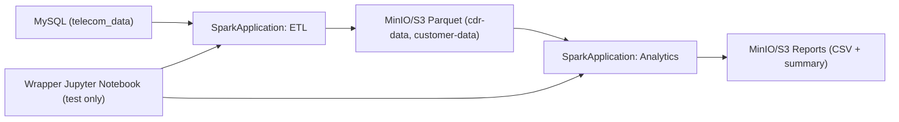

# Running Apache Spark on OpenShift: Hands-On with OpenShift AI


Author: Motohiro Abe


## Introduction

This blog covers my experiment with using the **Kubeflow Spark Operator** on **OpenShift** and integrating it with **OpenShift AI**.

In this post, I will walk through:

- Installing the Spark Operator  

- Running a Spark application from a Jupyter notebook in an OpenShift AI Data Science Project  

- Using Spark inside an OpenShift AI pipeline (Elyra)  

## Acknowledgments

This project learned from and reused content from the following upstream repositories:

- **[Spark on OpenShift](https://github.com/rh-aiservices-bu/spark-on-openshift)** – Spark on OpenShift patterns and examples.

- **[Workbench images](https://github.com/rh-aiservices-bu/workbench-images)** – Upstream workbench/Jupyter image build and usage (see [Building an image](https://github.com/rh-aiservices-bu/workbench-images/tree/main#building-an-image)).


## What is Apache Spark?

> "Apache Spark is a unified analytics engine for large-scale data processing. It provides high-level APIs in Java, Scala, Python, and R, and an optimized engine that supports general execution graphs."  

> — [Apache Spark Official Documentation](https://spark.apache.org/docs/latest/index.html)

### Example: Simple Spark Application

```python

from pyspark.sql import SparkSession

logFile = "YOUR_SPARK_HOME/README.md"  # Path to a file on your system

spark = SparkSession.builder.appName("SimpleApp").getOrCreate()

logData = spark.read.text(logFile).cache()

numAs = logData.filter(logData.value.contains('a')).count()

numBs = logData.filter(logData.value.contains('b')).count()

print("Lines with a: %i, lines with b: %i" % (numAs, numBs))

spark.stop()

```

## So, How Does Spark Work on OpenShift?

Spark applications run as a set of processes across the cluster, managed by the `SparkContext` in the driver program.

When running on OpenShift:

1. The driver connects to the Kubernetes API.  

2. The Spark Operator creates executor pods based on your `SparkApplication` Custom Resource (CR).  

3. Application code (JAR or Python files) is sent to the executors.  

4. Executors run the tasks and return results to the driver.


# High level workflow

- Part 1 — Data Engineer Persona  (Jpuyternotebook wiht OpenshfitAI clientmode) 

Target reader is a Data Engineer who wants to build and test Spark ETL logic quickly without dealing with Kubernetes complexity. This section uses OpenShift AI JupyterNotebook with Spark in client mode to develop and validate a Spark ETL pipeline against Telecom CDR data, covering schema exploration and data transformation logic.

- Part 2 — Data Scientist / ML Engineer Persona (Spark Operator)

Target reader is a Data Scientist or ML Engineer who needs a production-ready, scalable Spark pipeline. This section introduces the Spark Operator on OpenShift, submitting a SparkApplication for batch workloads with proper scaling, and uses Grafana to monitor job performance and resource usage.


## Example: Spark ETL & Telecom CDR Demo. (Part1, Moto)

The **Spark ETL & Telecom CDR Demo** repository demonstrates a real-world Spark analytics pipeline built for **OpenShift AI** using the **Spark Operator**. It implements a complete telecom Call Detail Record (CDR) data simulation and processing system, showcasing an end-to-end ETL workflow.

**Watch the demo video:**  

---

### What This Demo Shows

- GitOps-style deployment for the Spark Operator and Spark workloads to an OpenShift cluster.  

- Creating an OpenShift AI project for Spark applications.  

- **Spark notebooks** running on OpenShift AI (Jupyter) that perform the ETL process — extracting records from MySQL, writing Parquet files to object storage, and running analytics.  

- Use of **object storage (S3/MinIO)** between extract and analytics steps.  

- Running the Spark notebooks in sequence via **Elyra pipelines**.  

[View the Repository on GitHub](https://github.com/mabehiro/spark-etl-ods-demo)


## Example: Spark ETL & Telecom CDR Demo with application. (Part2, Monson)

In Part 2, the same Telecom CDR flow is executed in an **operator-first** model using `spark-etl-operator-demo`.
Instead of running ETL and analytics from notebooks, both workloads are submitted as **SparkApplication** CRDs.
Python job files are mounted to Spark pods from a **ConfigMap**, so transformation changes do not require rebuilding images.



Detailed manifests and execution steps are maintained in this repository:
- [spark-etl-operator-demo folder](https://github.com/mabehiro/spark-etl-ods-demo/tree/main/spark-etl-operator-demo)
- [Operator demo runbook](https://github.com/mabehiro/spark-etl-ods-demo/blob/main/spark-etl-operator-demo/docs/runbook.md)


## Conclusion

As an infrastructure engineer, understanding data-warehouse and data-lake architectures is becoming increasingly important. I believe that being able to run and experiment with your own Spark environment is a big advantage.

I hope this tutorial helps you get started with Spark on OpenShift and gives you a solid foundation for further exploration.
